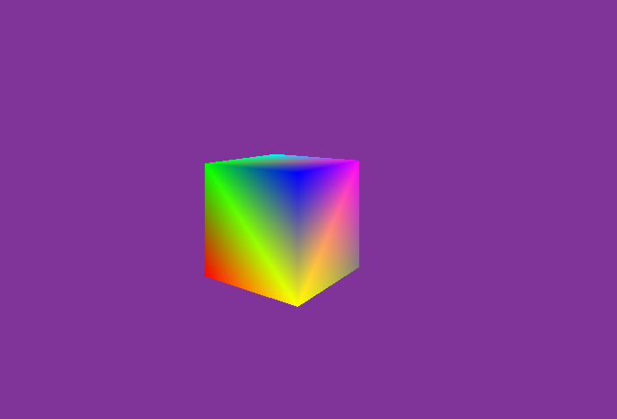
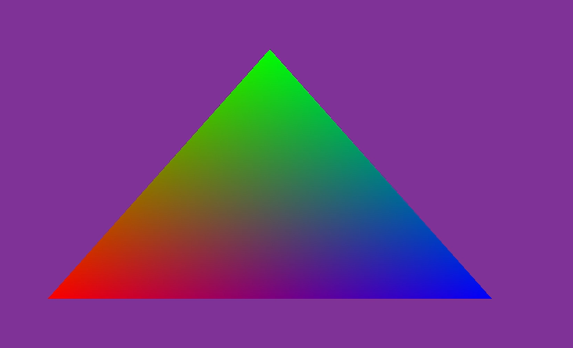

# Fantasy Engine
Fantasy Engine 

Fantasy Engine is a rendering engine build on top of DirectX 11. It's main goal is to show my understanding of the components for a rendering engine.
I called it Fantasy Engine because graphics and engine programming allows you to create your own fantasy world :)

## Download 

## Render Samples and Demos

Figure 2: Camera and Cube

Figure 1: Triangle 

[Link to Feature Playlist](https://www.youtube.com/playlist?list=PLahcOfCTPH8r57gGlewJuTvBM6HMdRo4Z)

[Link to all render samples and demos](https://github.com/wobey96/FantasyEngine/wiki/All-Screenshots-and-Demos)
## Main Features 

### Rendering 

### Engine 
* Free Flight Camera 

## Engine Architecture

## Repository Structure

## Dependencies 

## References 

## Acknowledgements
### Models & Textures

### Graphics Programming Community <3

Special shout-out to Angel Ortiz and Kostas Anagnostou. 
They were the first people I reached out to about graphics programming. Very helpful and supportive! 
